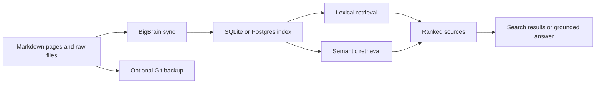

# BigBrain

BigBrain is a local-first knowledge runtime for AI agents and humans working
against the same durable memory.

Your knowledge stays in ordinary Markdown files and can be backed up with Git.
BigBrain adds the layer agents need around those files: indexing, hybrid
retrieval, grounded answers, controlled writes, health checks, automations,
MCP access, and a dashboard.

> **The short version:** Markdown and Git hold the knowledge you own. BigBrain
> turns it into memory that agents can reliably store, retrieve, and maintain.

## Start Here

The easiest setup is agent-led. Copy this into Codex or Claude Code:

```text
Install and set up BigBrain v0.17.0 by following https://github.com/life-efficient/bigbrain/blob/v0.17.0/INSTALL_FOR_AGENTS.md.
```

Or install it manually:

```bash
git clone https://github.com/life-efficient/bigbrain.git
cd bigbrain
npm install
npm link

bigbrain init /path/to/brain-home --name "My Brain"
bigbrain sync --json
bigbrain query "What should I know about this project?"
```

Requirements:

- Node.js 22.5 or newer
- an OpenAI API key for semantic search, reranking, and generated answers
- no API key is required for Markdown storage, indexing, links, or lexical search

BigBrain is local-first, not necessarily local-only. When an OpenAI API key is
configured, sync sends page text for embeddings, search can send the query and
candidate snippets for reranking, and `query` sends the question plus retrieved
context for grounded answer generation. Without a key, those stages are skipped.

See [`INSTALL_FOR_AGENTS.md`](./INSTALL_FOR_AGENTS.md) for guided setup and
[`skills/RESOLVER.md`](./skills/RESOLVER.md) for agent skill routing.

## The Two Parts of BigBrain

BigBrain has two primary elements:

| | Storage | Retrieval |
| --- | --- | --- |
| Purpose | Keep durable, inspectable knowledge | Find the right context when an agent needs it |
| Canonical layer | Markdown files, optionally backed by Git | The original Markdown pages returned as sources |
| Runtime layer | SQLite locally or Postgres on a server | Lexical search, embeddings, ranking, and grounded synthesis |
| Core principle | The database is not the authored source of truth | Search remains useful even when AI-powered stages are unavailable |



## 1. Storage

BigBrain deliberately separates authored knowledge from runtime state.

### Canonical knowledge

The brain home contains the files people and agents author:

- Markdown pages organized by subject
- relative Markdown links between pages
- task pages with explicit status and ownership
- raw files such as PDFs, transcripts, decks, images, and spreadsheets
- same-basename Markdown sidecars that make raw files searchable

Markdown remains readable without BigBrain and can be versioned, reviewed,
backed up, or moved with normal Git and filesystem tools.

The default page collections are:

```text
people/          organizations/   deals/
projects/        ideas/           meetings/
tasks/           concepts/        writing/
protocol/        archive/
```

File by primary subject, not by source or format. The active brain's
`filing_rules` output is the operational source of truth for exact paths.

### Raw files and sidecars

Raw files live under the collection they support:

```text
<collection>/.raw/<basename>.<ext>
<collection>/.raw/<basename>.md
```

The binary is not indexed directly. Its same-basename Markdown sidecar is the
private, searchable representation and can hold extraction, synthesis,
provenance, links, visibility, and group metadata.

### Runtime state

`bigbrain sync` parses the Markdown corpus and builds a derived runtime
projection containing:

- page metadata and searchable text
- forward links and backlinks
- lexical search indexes
- embedding chunks and vectors
- recent activity, health, and automation state
- member, authentication, and audit state for server deployments

For a device-managed brain, this normally lives under:

```text
<brain-home>/.bigbrain-state/
```

BigBrain automatically adds this directory to the brain home's `.gitignore`.
Never commit or publish it: it can contain the SQLite index, member records,
authentication state, and bounded audit history.

SQLite is the default local backend. Production server deployments normally use
Postgres and pgvector. In both cases, authored Markdown remains canonical; the
searchable projection can be rebuilt from it. Mutable operational state such as
OAuth grants and audit history should still be persisted and backed up
appropriately.

## 2. Retrieval

BigBrain separates **search** from **query**:

- `get` directly reads a known canonical page.
- `links` and `backlinks` inspect explicit relationships in the indexed graph.
- `search` returns ranked pages and snippets. It does not generate an answer.
- `query` runs the same retrieval pipeline, then generates a concise answer
  grounded in the retrieved context with citations back to source page slugs.
- `pages/query` runs safe structured filters over indexed page fields and flat
  front matter, returning compact rows, counts, and offset pagination. It is
  useful for deterministic questions such as how many people or deals match a
  condition, without retrieving page bodies or relying on semantic search.

### How retrieval works today

For each request, BigBrain currently:

1. **Classifies the query intent** as an entity lookup, temporal question,
   event question, or general search so ranking can weight evidence differently.
2. **Optionally expands the query** into up to two alternate searches in
   `tokenmax` mode. The original query always remains included.
3. **Runs lexical retrieval** over indexed titles, summaries, compiled truth,
   timelines, and page text.
4. **Runs semantic retrieval** by embedding the query and comparing it with
   stored page chunks. For SQLite this uses cosine similarity in-process; for
   Postgres it uses pgvector.
5. **Keeps the best semantic chunk per page** so one long page does not crowd
   out the rest of the result set.
6. **Fuses lexical and semantic rankings** using weighted reciprocal-rank
   fusion.
7. **Adds deterministic boosts** for exact page or slug matches, aliases, title
   phrases, ordered title tokens, and full title-token coverage.
8. **Reranks the candidate set with OpenAI** in `balanced` and `tokenmax` modes.
   If that step fails, BigBrain keeps the pre-rerank order.
9. **Returns ranked sources** with snippets and optional score explanations.
10. **For `query`, synthesizes a grounded answer** from those sources and cites
    the supporting page slugs. If generation is unavailable, the retrieved
    context is still returned.

Semantic retrieval, reranking, query expansion, and answer generation require
`OPENAI_API_KEY`. When those stages are unavailable, BigBrain degrades to
lexical retrieval and reports what was skipped instead of silently guessing.

### Search modes

| Mode | Query expansion | OpenAI reranking | Default results |
| --- | ---: | ---: | ---: |
| `conservative` | No | No | 10 |
| `balanced` (default) | No | Yes | 10 |
| `tokenmax` | Yes | Yes | 25 |

Use `--explain` to inspect retrieval evidence and score components:

```bash
bigbrain search "Ariana Properties" --mode balanced --explain
bigbrain query "What changed in this deal?" --mode tokenmax --explain
```

The MCP `pages/query` tool supports exact matches, ordered comparisons, set
membership, existence checks, path/type filters, selected front-matter fields,
and count-only queries. Existing pages do not need new fields: absent
front-matter remains absent, and the runtime index applies its query indexes
when each brain opens.

BigBrain also includes synthetic and private retrieval evals so ranking changes
can be tested rather than judged from a handful of anecdotes. See
[`docs/design.md`](./docs/design.md#hybrid-retrieval) for the retrieval design
and run `bigbrain eval retrieval` for the public suite.

## Local and Remote Operation

There are two user-facing ways to run BigBrain. The knowledge model is the same
in both; what changes is who manages the service and where its runtime state
lives.

| | Run BigBrain on this device | Connect to an existing BigBrain |
| --- | --- | --- |
| Best for | Personal use, private work, local development | Teams, shared brains, always-on access |
| Service owner | You and the local BigBrain installation | A hosted, self-hosted, or on-prem operator |
| Canonical knowledge | Markdown in a local brain home, optionally Git-backed | Markdown in the service's selected brain home or Git-backed content repo |
| Runtime database | SQLite by default | Postgres/pgvector by default |
| Access | Loopback CLI, MCP, and dashboard | HTTPS MCP and dashboard |
| Authentication | None on trusted loopback by default | OAuth allowlist by default |
| Lifecycle | Local CLI, desktop app, or LaunchAgent | Independently managed server or Docker deployment |

“Remote” describes the relationship between the client and the BigBrain
service. It does not require BigBrain-operated hosting. The service can be:

- hosted by the BigBrain operator
- self-hosted in your own cloud
- deployed on-premises
- running on the same physical machine but managed as an independent service

Docker is the canonical server package. A client connects to a remote or
server-managed brain without taking responsibility for its process, database,
backups, or upgrades.

Connect Codex to an existing service with:

```sh
bigbrain connect codex https://your-service.example.com/mcp \
  --name example-brain \
  --auth oauth
```

See [`docs/packaging-architecture.md`](./docs/packaging-architecture.md) for the
full packaging model and [`docs/mcp-hosting.md`](./docs/mcp-hosting.md) for
deployment and authentication.

## Shared Multi-Person BigBrain

A shared BigBrain is one isolated BigBrain service serving one configured
brain. It is not a multi-tenant database containing unrelated brains.

Each shared deployment has its own:

- Markdown corpus and Git history
- Postgres database and embeddings
- member directory
- authentication boundary and secrets
- backup lifecycle
- bounded audit log

### Identity and access

Each member maps an authenticated email address to a canonical `people/<slug>`
page:

```sh
bigbrain members add alice@example.com people/alice \
  --name Alice \
  --role member
```

OAuth allowlisting gives each connected person or agent its own credential.
The current hosted OAuth flow uses Google identities.
Server tools are exposed according to explicit scopes:

- `brain:read` for reading, listing, search, query, and raw-file access
- `brain:create` for page, task, and raw-file contributions
- `brain:publish` for deliberately publishing pages or shared groups
- separate privileged scopes for destructive raw-file operations, Git backup,
  maintenance, and administration

New OAuth clients receive read and create access by default, subject to the
server's configured scope ceiling. Internet-reachable shared deployments should
use OAuth rather than a shared bearer token.

### Collaboration model

- Everyone reads from and contributes to the same canonical brain.
- Only active members can be assigned work in `tasks/*.md`.
- `assignee=me` resolves to the authenticated member.
- MCP contributions can be attributed to the authenticated email in page
  timelines, Git backup messages, and bounded audit records.
- Writes can trigger sync and, when enabled, Git backup so the shared index and
  durable corpus stay aligned.
- Concurrent updates to the same page are currently last-writer-wins; BigBrain
  does not yet provide page locking or revision-conflict detection.
- Private brain access and public sharing are separate. Publishing a page,
  attachment, or curated group requires an explicit visibility action.

Agents remain separate from the knowledge service. Codex, Claude, Relay,
browsers, and local scripts can all connect to the same BigBrain over MCP while
BigBrain provides the shared memory and access boundary.

## Brain Model

Canonical pages live under typed top-level directories. A normal page contains:

1. YAML frontmatter
2. a title and short executive summary
3. compiled truth or current state
4. open threads where relevant
5. an append-only timeline or evidence log

Meeting pages use one canonical file across preparation and follow-up, with
sections such as `Prep`, `Summary`, `Key Decisions`, `Action Items`, and
`Discussion Notes`.

Task pages are individual files under `tasks/`:

```yaml
---
title: Follow up on proposal
status: open
readiness: ready
execution_mode: agent
priority: p1
assignees: [people/alice]
source: [meetings/proposal-review]
due: 2026-07-31
---
```

Valid task statuses are `open`, `in_progress`, `waiting`, `done`, and
`archived`. Execution mode distinguishes autonomous agent work (`agent`),
guided work needing judgement (`interactive`), and real-world work only the
person can do (`user`).

Run `bigbrain schema` for the live page and filing contract.

## Common Commands

```bash
bigbrain init /path/to/brain-home --name "My Brain"
bigbrain sync --json
bigbrain search "query terms"
bigbrain query "grounded question"
bigbrain links people/alice
bigbrain backlinks people/alice
bigbrain recent --since 24h
bigbrain tasks --assignee people/alice
bigbrain health --json
bigbrain schema
bigbrain --version
bigbrain dashboard
bigbrain eval retrieval
bigbrain update --check
bigbrain events status
bigbrain events listeners
bigbrain events inbox --state failed
```

Packaged desktop installations update through the version control in the app
header or the **Check for Updates** menu action. The `bigbrain update` command
and the `bigbrain-check-update` compatibility skill are for source-managed
installations. Neither path changes remote or server-managed services.

Target a non-default brain with `--brain-home /path/to/brain-home`.

BigBrain resolves the brain home in this order:

1. `--brain-home /path/to/brain-home`
2. `BIGBRAIN_HOME=/path/to/brain-home`
3. `~/.config/bigbrain/default-brain-home`

Machine-local secrets live outside both the source repo and brain home:

```text
~/.config/bigbrain/.env
```

Add `OPENAI_API_KEY=...` there to enable embeddings, semantic retrieval,
reranking, and generated answers.

## Inbound events

BigBrain includes a generic inbound event runtime for RSS feeds and signed
webhooks. The canonical client registry and durable inbox live at:

```text
~/.config/bigbrain/event-registry.json
~/.config/bigbrain/event-inbox.json
```

Listeners are editable as JSON, through the `events/*` MCP tools, or through
the BigBrain CLI. A listener
can independently choose where collection occurs (`client` or `host`) and
where Codex runs (`client` or `host`), with either a visible `app_thread` or a
background `cli` execution. Registry subscriptions may name only registered
Brain IDs.

RSS polling and webhook intake are separate runtime planes. RSS owns feed
polling, seven-day initial cursors, and item deduplication. Webhooks own HTTP
authentication, configured event-type filtering, and enqueueing. They share
only the registry, durable inbox, and common processor, so an outage in one
plane does not stop the other.

Webhook event types are filtered before an inbox item or Codex task is created.
For example:

```bash
bigbrain events configure granola \
  --event-type-path event_type \
  --event-type note.generated \
  --prompt-field event_type \
  --prompt-field granola_id \
  --prompt-field title \
  --prompt-field status \
  --prompt-field summary \
  --prompt-omit-field calendar_event
```

Event tasks receive the selected payload fields plus only minimal source
context. The internal event envelope remains available to the inbox for
deduplication, audit, retry, and provenance, but it is not pasted into every
Codex task.

Event listeners can also choose the Codex task model, reasoning effort, and a
fallback chat title. Granola webhook payloads do not include the meeting title,
so Granola tasks use the configured fallback title:

```bash
bigbrain events configure granola \
  --model gpt-5.6-luna \
  --reasoning-effort xhigh \
  --chat-title "Granola meeting ingestion"
```

The title is applied to the Codex task after it is created. The model and
reasoning effort are applied to both the task and its first turn.

Granola listeners should accept `note.generated`, which is emitted when a
meeting note's initial AI summary is ready. The event payload identifies the
note but does not contain the full meeting content, so the event task retrieves
the note through the Granola MCP using `granola_id` before filing it. Granola
webhook signatures use the provider's Standard Webhooks headers and secret.

Every accepted event is normalized into the durable inbox. Useful events start
a normal Codex ingestion task, which invokes the configured BigBrain skill and
uses the associated MCP for filing, source queries, cleanup when explicitly
authorized, and read-back verification. The inbox remains the durable audit
and retry ledger; it is not a second filing path. Ignored events retain bounded
metadata only, and failed useful events remain retryable.

RSS items use the source-article ingest route. The route first applies a digest
value test: keep an item only when it is useful for mastery, sector awareness,
conversation, or personal enrichment. Routine collaboration announcements,
privacy-policy changes, hiring or promotional updates are normally ignored
unless they carry a durable implication. A kept item preserves the fetched
article as a raw source artifact and creates a standard Brain sidecar with a
summary, compiled truth or current relevance, related-page links, source
provenance, and a timeline. It may also update existing canonical pages when
the article materially changes their durable understanding.

RSS listeners can control source retrieval with `article_policy`. For example:

```json
{
  "article_policy": {
    "fetch_source": true,
    "preserve_source": true,
    "require_source": true,
    "max_bytes": 2000000,
    "timeout_ms": 30000
  }
}
```

If a relevant article cannot be fetched completely, the event remains explicit
for review instead of being filed as a synthetic summary.

The first clean client setup adds OpenAI News with no historical backfill. For
organization-owned feeds, run the same runtime on the organization host and
deliver subscribed events through the self-hostable relay in
`deploy/event-relay/`.

Use the RSS status operation to inspect the live feed without enqueueing events
or creating Codex tasks:

```bash
bigbrain events rss-status [--listener LISTENER_ID] [--limit N]
```

Older feed items are only eligible for a deliberate, explicitly selected manual
backfill. The command defaults to a dry run; use exact stable item IDs from the
status output and add `--apply` to enqueue them. The existing seven-day initial
cursor and normal polling guard remain in force, and manual backfill is bounded
to 25 selected items per invocation:

```bash
bigbrain events rss-backfill LISTENER_ID \
  --item-id LISTENER_ID:STABLE_HASH [--item-id LISTENER_ID:STABLE_HASH ...] \
  [--dry-run|--apply]
```

## Dashboard and Desktop App

Start the local dashboard:

```bash
bigbrain dashboard
```

For desktop development:

```bash
npm run desktop:dev
```

To point the desktop shell at an existing BigBrain dashboard:

```bash
BIGBRAIN_DASHBOARD_URL=https://your-service.example.com/dashboard \
  npm run desktop:dev
```

Build distributable macOS artifacts with `npm run desktop:dist`.

## Documentation

- [Design and data model](./docs/design.md)
- [Packaging architecture](./docs/packaging-architecture.md)
- [MCP hosting and authentication](./docs/mcp-hosting.md)
- [Postgres migration](./docs/postgres-migration.md)
- [Example server deployment](./docs/example-brain-deployment.md)
- [Releases and updates](./docs/releases.md)
- [Changelog](./CHANGELOG.md)
- [Current roadmap](./TODO.md)

## Development

```bash
npm test
npm run build:dashboard
npm pack --dry-run
```

BigBrain is released under the [MIT License](./LICENSE).
